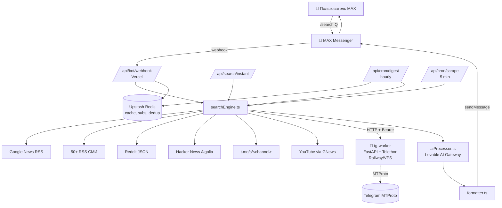

# Architecture

## Поток `/search`

1. MAX шлёт webhook → `webhook/route.ts` (тонкий слой).
2. `bot/router.ts` маршрутизирует команды или свободный текст как поиск.
3. Idempotency + rate limit (настраивается через env).
4. `services/searchPipeline.ts` — статус → `searchEngine` → `aiProcessor` → отправка.
5. `sources/registry.ts` — плагинные источники (GN, RSS, Reddit, HN, TG×2, YouTube).
6. Дедуп в `core/dedupe.ts`: URL → SHA заголовка → Левенштейн ≥ 0.85.
7. LLM tool-calling → `formatter` (+ статистика источников, split длинных сообщений).

## Поток ежечасного digest

1. Vercel Cron триггерит `digest/route.ts` (Bearer от Vercel).
2. Redis SCAN `sub:*` → список (userId, query).
3. Для каждой подписки: searchEngine + aiProcessor.
4. Дедуп через `seen:<userId>:<urlHash>` (TTL 24 ч).
5. Если новых нет — пропускаем (или раз в сутки шлём «ничего не найдено»).
