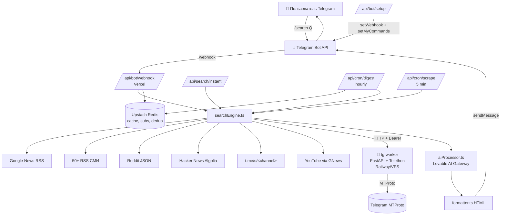

# Architecture

## Поток `/search`

1. Telegram шлёт Update → `webhook/route.ts` (проверка `X-Telegram-Bot-Api-Secret-Token`).
2. `bot/router.ts` — команды, inline-кнопки или свободный текст.
3. Idempotency + rate limit (Redis).
4. `services/searchPipeline.ts` — статус → `searchEngine` → `aiProcessor` → отправка.
5. `sources/registry.ts` — GN, RSS, Reddit, HN, TG×2, YouTube.
6. Дедуп в `core/dedupe.ts`.
7. HTML-дайджест + inline-кнопки «Обновить / Подписаться».

## Поток ежечасного digest

1. Vercel Cron → `digest/route.ts`.
2. Redis SCAN `sub:*` → список подписок.
3. searchEngine + aiProcessor → только новые материалы.
4. `sendLongMessage` в Telegram chat_id подписчика.

## Настройка бота

`GET /api/bot/setup?url=...` (Bearer `CRON_SECRET`):
- `setWebhook` с `secret_token`
- `setMyCommands` — меню `/` в Telegram
